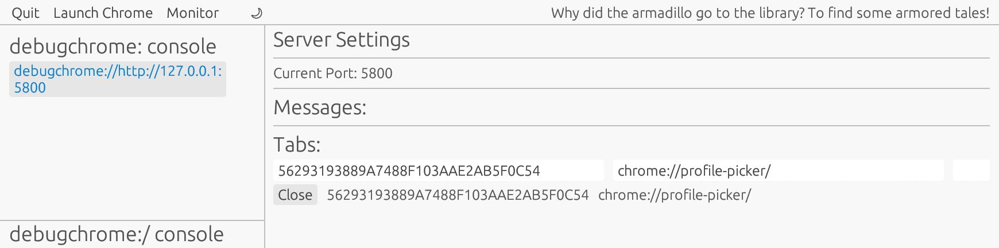
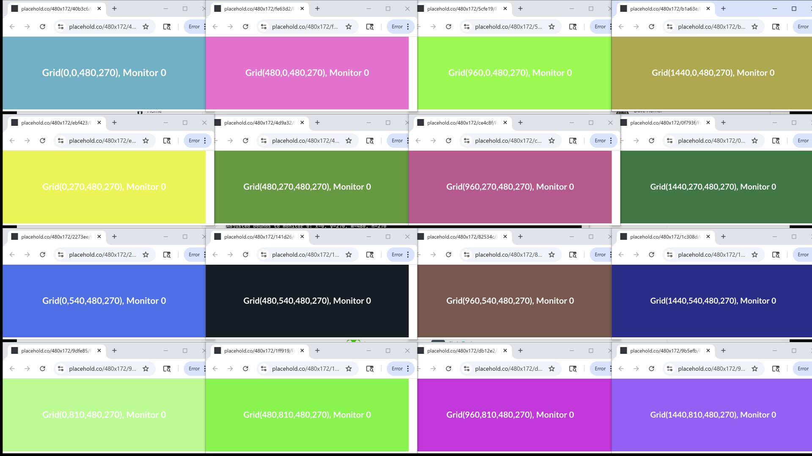

### README.md

# debugchrome-cdp-rs

`debugchrome-cdp-rs` introduces a command `debugchrome` and a custom windows protocol, `debugchrome:` and `debugchrome://`.  It is currently windows only.

When using default protocol handlers, the url opens in the default browser.  There is no cross platform way to interact with the programs that launch or the documents themselves after launch.  Url invocation gives you no way to interrogate the system to determine what exact tab and program the user is interacting with.

Using something like open, cmd /c start, [open::that](https://github.com/Byron/open-rs) the default application runs but there are no great ways to query/interact with that unknown servicing application and document.

Sometimes default handlers aren't set, other times the api may return incorrect results, or the browser just doesn't open as it should. [#73](https://github.com/Byron/open-rs/issues/73)  It's unreliable like udp; `chromedebug` helps make default open more reliable by providing mechanisms to query and control past the point of open.

**`debugchrome` is a program and protocol handler designed to open a http(s) url in a --remote-debugging-port=9222 chrome browser.**

The protocol works if you specify `debugchrome:` or `debugchrome://` before your url and add the !bang variables at the end of your query to control operation.

- As of 0.1.8, `debugchrome` includes an egui console to manage and view debug instances of chrome and associated tabs.  Open an empty `debugchrome:/` url and the gui will launch.
  When you are running the gui, you are also running a salvo webserver; if this webserver is available - `debugchrome.exe` will utilize the webserver instead of interrogating chrome itself.
  The gui is not yet used to perform searches and other functions...it will in future releases.

  If you don't enjoy LLM jokes; turn it off via the `uses_funny` feature flag. `cargo run --no-default-features --features "uses_gui"`
  If you compile without the gui and without the funny; you'll find just the protocol handler.  The webserver is tied directly to the gui for now.

- 0.1.7 introduced initial_payload redirection and tracking via #hash in the url.  This is preferable to session and document variables in some cases - specifically pages that don't support javascript.

---

## Features

1. **Open a url (brought to front and at location on screen)**:
   - Opens a specified URL with optional window placement / bounds (`!x`, `!y`, `!w`, `!h`).
   - Supports `--direct` to open the URL directly, or uses a timed HTML redirect if omitted (see below).
   - Supports `--redirect-seconds <N>` to set the delay for HTML-based redirects.
2. **Script Execution**:
   - Use `--script <js>` or `--script-file <path>` to execute JavaScript in the target tab after it opens.
   - Example: `debugchrome.exe --script "alert('Hello from debugchrome!')" "debugchrome:https://www.rust-lang.org?!id=jsdemo"`
   - Example: `debugchrome.exe --script-file myscript.js "debugchrome:https://www.rust-lang.org?!id=jsdemo"`
   - Example: `debugchrome:https://www.rust-lang.org?!x=0&!y=0&!w=800&!h=600`
   - Window bounds can be expressed as a percentage and relative to a monitor
   - Example: [`debugchrome://https://www.rustlang.org?!x=12.5%&!y=12.5%&!w=75%&!h=75%&!monitor=2`](debugchrome://https://www.rustlang.org?!x=12.5%&!y=12.5%&!w=75%&!h=75%&!monitor=2)
3. **Set `id` (bangId)**:
   - Sets a custom `id` in the tab's JavaScript context (session storage so it persists refresh) using the `!id` parameter in the URL.
   - If `!id` is present but empty, a timestamp-based ID is assigned automatically.
   - Example: `debugchrome:https://www.rust-lang.org?!id=` (auto-assigns ID)
   - Example: `debugchrome:https://www.rust-lang.org?!id=123`
   - This Id is used to annotate the url with an ID that can be used to find and interact with the tab.
4. **Diagnostics and Logging**:
   - On Windows, logs HWND, PID, tab title, and URL for matched tabs to help with automation and troubleshooting.
   - Lists all tabs and their parameters during window creation for easier debugging.
5. **Timeout**:
   - `debugchrome` will wait for the specified number of seconds and then search and close the page automatically.
   - Example: `debugchrome://https://crates.io/crates/debugchrome-cdp-rs?!timeout=5`
6. **Keep Focus**
   - Add a !keep_focus parameter in the url and the window that is currently active will be re-focused after the page is loaded.
   - Example: [`debugchrome://https://crates.io/crates/debugchrome-cdp-rs?!id=21jump&!keep_focus`](debugchrome://https://crates.io/crates/debugchrome-cdp-rs?!id=21jump&!keep_focus)
   This allows you to launch a url from cmd or powershell and not have the webpage take focus away from the terminal.
7. **Take a Screenshot**:
   - Captures a screenshot of the page and opens the default viewer for `.png`.
   - Example: `debugchrome:https://www.rust-lang.org?x=0&y=0&w=800&h=600&!id=123&!screenshot`

8. **Search for Tabs by `bangId`**:
   - Searches all open tabs for a specific `bangId` and prints the matching tab's URL.

9. **Register Custom Protocol**:
   - Registers the `debugchrome:` protocol in the Windows registry for easier usage.

---

## Usage
### Direct vs. Redirect Launch

By default, debugchrome uses a small HTML payload to redirect to the target URL after a delay (set by `--redirect-seconds`). Use `--direct` to skip the redirect and open the URL immediately.

Examples:

- Direct launch:
  ```bash
  debugchrome.exe --direct "debugchrome:https://www.rust-lang.org?!id=directdemo"
  ```
- Delayed redirect:
  ```bash
  debugchrome.exe --redirect-seconds 5 "debugchrome:https://www.rust-lang.org?!id=delaydemo"
  ```
### Script Execution

You can execute JavaScript in the target tab using `--script` or `--script-file`:

```bash
debugchrome.exe --script "alert('Hello!')" "debugchrome:https://www.rust-lang.org?!id=jsdemo"
debugchrome.exe --script-file myscript.js "debugchrome:https://www.rust-lang.org?!id=jsdemo"
```
### Automatic bangId Assignment

If you specify `!id=` (empty), debugchrome will automatically assign a timestamp-based bangId for you. This ensures every tab can be tracked and controlled reliably.

Example:
```bash
debugchrome.exe "debugchrome:https://www.rust-lang.org?!id="
```
### Diagnostics and Logging

On Windows, debugchrome logs the HWND, PID, tab title, and URL for matched tabs. This information is printed to the console and written to the log file for automation and troubleshooting.

Example output:
```
HWND: 0x0003059A
PID: 12345
TITLE: Rust - Empowering Everyone
TARGET: 1a2b3c4d5e6f7g8h9i
PAGE_URL: https://www.rust-lang.org
```
### Error Handling and Debug Logging

Debugchrome now provides more robust error messages and detailed debug output throughout the tab lifecycle. Check the log file for diagnostics if something doesn't work as expected.

Prefix any url with `debugchrome:` and that url will be processed by debugchrome.

The protocol begins `debugchome:` then your url, followed by ! bang parameter variables.  In other words, all parameters operated on by `debugchrome` are assumed to be appended to the end of the url (not interdispersed) and the variables debugchrome deals with begin with the !.  This makes it easy to determine the clean url and limits clashing with existing variables.

debugchome addresses common challenges such as controlling the location of the browser window, determining if a url is open, closing a tab, setting custom data (`bangId`) in the JavaScript context, and even capturing screenshots. By using the `debugchrome:` protocol, you've got a way to position, query, and control default document open.

### 1. **Register the `debugchrome:` Protocol**
If you want to use `debugchrome:\\` urls, you will first need to register the path to the executable in the windows registry.
```bash
debugchrome.exe --register
```
- Writes a debugchrome.reg file next to the debugchrome.exe (typically in your .cargo/bin)
- Registers the `debugchrome:` protocol in the Windows registry (given permissions).
- Allows you to use `debugchrome:` URLs directly.


### 2. **Open a url**
```bash
debugchrome.exe "debugchrome:https://www.rustlang.org?!x=0&!y=0&!w=800&!h=600"
```
- Opens a specified URL.
- add any of ! query parameters:
  - `!x`: X-coordinate of the window.
  - `!y`: Y-coordinate of the window.
  - `!w`: Width of the window.
  - `!h`: Height of the window.
  - etc

### 3. **Set `id`**
```bash
debugchrome.exe "debugchrome:https://www.rustlang.org?!x=0&!y=0&!w=800&!h=600&!id=123"
```
- Sets `window.bangId` in the tab's JavaScript context to `123`.

### 4. **Search for page by `id`**
```bash
debugchrome.exe --search 123
```
- Searches all open tabs for a tab where `window.bangId` is `123`.
- Prints the matching tab's URL if found.

### 5. **Take a Screenshot**
```bash
debugchrome.exe "debugchrome:https://www.rust-lang.org!screenshot"
```
- Captures a screenshot of the tab and opens the default viewer for the screenshot.

### 6. **Keep Focus**
```bash
debugchrome.exe "debugchrome:https://www.rust-lang.org?!keep_focus"
```
- Ensures the window that was in focus at time of open is the window that remains in focus on exit.

### 7. **Close a Tab**
```bash
debugchrome.exe --search 123 --close
```
- Searches for the tab with the specified `bangId` and closes it.
- Example: `debugchrome.exe --search 123 --close` will close the tab where `window.bangId` is `123`.
- **Note**: The `!id` parameter must be specified when opening the tab to use this feature.
- **Note**: Specifying `!close` without an `!id` will not close, if you specify close and the page isn't found, the page will be opened.  The same url with the `!close` specified, will then close the page when opened again.
- Example: `debugchrome.exe "debugchrome:https://www.rust-lang.org!id=1&!close&!openwindow&!keep_focus"` will open and close a window without taking focus.

### 8. **Refresh a Tab**
```bash
debugchrome.exe --search 123 [--close]
```
- Searches for the tab with the specified `id` and activates it.  If !refresh is specified on the url, the page will be refreshed after being activated.
- Example: `debugchrome.exe --search 123 --close` will close the page where `window.bangId` is `123`.
- Example: `debugchrome.exe "debugchrome:https://www.rust-lang.org?!refresh"` will close the page after 10 seconds.
- **Note**: The `!id` parameter must be specified when opening the tab to use this feature.

### 9. **Set Timeout**
```bash
debugchrome.exe "debugchrome:https://www.rust-lang.org?!timeout=10"
```
- Sets a timeout (in seconds) for the tab to remain open.
- Example: `debugchrome.exe "debugchrome:https://www.rust-lang.org?!timeout=10"` will close the page after 10 seconds.

### 10. **Specify Monitor**
```bash
debugchrome.exe "debugchrome:https://www.rust-lang.org?!monitor=2"
```
- Opens the tab on a specific monitor.
- Example: `debugchrome.exe "debugchrome:https://www.rust-lang.org?!monitor=2"` will open the tab on monitor 2.
- Monitor indices start from 0.


### 11. **Open Window**
```bash
debugchrome.exe "debugchrome:https://www.rust-lang.org?!openwindow"
```
- Opens the url as a new window instead of as a tab.
- Example: `debugchrome.exe "debugchrome:https://www.rust-lang.org?!openwindow"` will open the url in a new window.

### 12. **GUI Console**  
   
    - When built with the `uses_gui` feature, launches an interactive egui-based console to view and manage Chrome debug sessions.  
    - Also runs an embedded Salvo webserver (default port 5800) for HTTP API access.  
    - Run with the empty protocol to start the GUI:  
      ```
      debugchrome.exe debugchrome:/
      ```  
    - Or launch it via any browser address bar or shell-exec protocol handler:  
      ```
      explorer.exe      debugchrome:/
      ```


## Sample CLI
1. **Open a url using cli**:
   `debugchrome.exe "debugchrome:https://www.rustlang.org?!x=0&!y=0&!w=800&!h=600&!id=456"`
2. **Search for a page by id using cli**:
   `
   debugchrome.exe --search 456
   `

3. **Register the Protocol using cli**:
   `
   debugchrome.exe --register
   `

---

## How It Works

You can run a debug browser and open things in there to get programatic access to your tab information; you need a protocol handler installed to allow default open urls into that debugger enabled environment.

### Opening a url
- Uses the `Target.createTarget` CDP method to open a new tab with the specified URL.
- Optionally sets window bounds using `Browser.setWindowBounds`.

### Setting `bangId`
- Parses the `!id` parameter from the URL.
- Uses the `Runtime.evaluate` CDP method to set `window.bangId` in the tab's JavaScript context.

### Taking a Screenshot
- Enables the `Page` domain using `Page.enable`.
- Captures a screenshot using `Page.captureScreenshot`.
- Saves the screenshot as `screenshot.png`.

### Searching for Tabs
- Fetches all open tabs using the `http://localhost:9222/json` endpoint.
- Connects to each tab's WebSocket and evaluates `window.bangId` using `Runtime.evaluate`.
- Matches the `bangId` with the search query.

### Registering the Protocol
- Writes a `.reg` file to register the `debugchrome:` protocol in the Windows registry.
- Allows you to use `debugchrome:` URLs directly.

---

## Example Output

Output is minimal to stdout; detailed output can be found in `%USERPROFILE%\.cargo\bin\debugchrome.log` or next to wherever `debugchrome` lives.  The same is true for the screenshots; it saves a single `%USERPROFILE%\.cargo\bin\debugchome.png` / `& "$env:USERPROFILE\.cargo\bin\debugchrome.png"` or next to the executable.  Sorry for the loose files in bin, at least they all start with debugchrome; this may change in the future.  Chrome profile folders are kept in %TEMP%\ starting with debugchrome.

---

## Notes

1. **Dependencies**:
   - Ensure that Chrome is running with the `--remote-debugging-port=9222` flag.  If it's not running, it will attempt to start it for you.

2. **Skipped Tabs**:
   - Tabs with URLs starting with `ws://`, `chrome-extension://`, `chrome://`, , `about:`, `data:`, `view-source:`, `devtools://`, or `chrome-devtools://` are skipped during the search.

3. **It's not fast**:
   - If you need to scan 400 tabs; it is going to take some time.

---

## Stress Testing

Included is a stress‐test script to verify `debugchrome` behavior:

File: `test-scripts/stress-test01.py`  
Description: Divides each connected monitor into a grid of windows and opens a placeholder image in each cell via `debugchrome.exe`.  
Dependencies:
- Python 3.8+
- screeninfo (`pip install screeninfo`)
- ctypes (stdlib)
- concurrent.futures (stdlib)
- debugchrome.exe (must be in PATH)

Usage:
```powershell
python test-scripts\stress-test01.py
```

stress-test01.py screenshot:



---


## Recent Features (0.1.11+)

- **`--direct` and `--redirect-seconds` CLI flags**: Control whether a tab is launched directly to the target URL or via a timed HTML redirect. Useful for pages that block JavaScript or need a delay before navigation.
- **Script execution**: Use `--script` or `--script-file` to inject and execute JavaScript in the target tab after launch.
- **Automatic bang ID assignment**: If `!id` is present but empty, a timestamp-based ID is assigned automatically for reliable tab tracking.
- **HWND, PID, title, and URL logging (Windows-only)**: When a tab is matched, its window handle, process ID, title, and URL are logged for diagnostics and automation.
- **Flexible redirect logic**: Depending on `--direct` and delay, either inline navigation or an HTML-based redirect is used for robust tab opening.
- **Improved diagnostics**: Tab listing and parameter logging during window creation for easier debugging and automation.
- **Graceful error handling and debug logging**: More robust error messages and detailed debug output throughout the tab lifecycle.

## License

This project is licensed under the MIT License.
David Horner 5/25